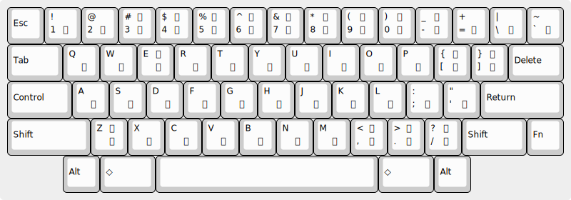
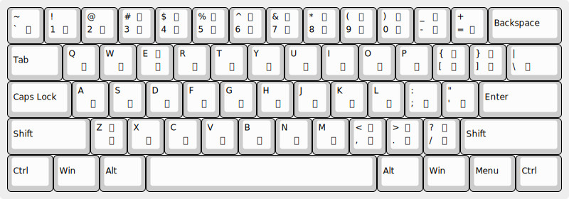

# kkh.el

## 概要

kkh.el は Emacs 上で動作する日本語入力です。

USかな入力 (英語キーボード上の JISかな入力) またはローマ字入力で入力を行います。

日英混在文を楽に入力できる操作感を目指しています。

かな漢字変換には
[Google CGI API for Japanese Input](https://www.google.co.jp/ime/cgiapi.html)
を利用しています。
変換内容は、暗号化されずにインターネットを通じて送受信されますので、ご注意ください。

## USかな配列

kkh.el の USかな配列の、キーとかなの対応を図に示します。

`「`/`」` (かぎ括弧) は `[`/`]` (square bracket) に合わせて横並びに配置、 `ー` (長音記号) は `Shift+ほ` の位置にある `_` (underscore) で入力します。
`む` や `ろ` のキー `\` (backslash) や `` ` `` (grave accent) の位置は、キーボードによって異なるかもしれません。

### [Happy Hacking Keyboard](https://happyhackingkb.com/jp/) 英語配列



### 一般的な英語配列キーボード



## ローマ字入力

kkh.el のローマ字かな変換ルールは Emacs の leim/quail/japanese.el 由来のものです (ただし、全角の数字・記号は半角にしています)。

`ん` は `n` または `n'` (`a`/`i`/`u`/`e`/`o`/`y` が続く場合) で入力します。
例: `konna` → `こんな`; `ken'aku` → `けんあく`

特徴的なルールを挙げます。

| 入力       | かな       | 備考           |
|:-----------|:-----------|:---------------|
| `tyi`      | `てぃ`     |                |
| `dyi`      | `でぃ`     |                |
| `dyu`      | `どぅ`     |                |
| `la`..`lo` | `ら`..`ろ` | `l` は「ら行」 |
| `wi`       | `ゐ`       |                |
| `we`       | `ゑ`       |                |
| `xwi`      | `うぃ`     |                |
| `xwe`      | `うぇ`     |                |
| `xwo`      | `うぉ`     |                |
| `z/`       | `・`       | `/` は `/`     |

## インストールとセットアップ

kkh.el を `load-path` の通ったところに置いて init.el に次のように書きます。

``` emacs-lisp
(when (require 'kkh nil t)
  (setq default-input-method "japanese-kkh")
  ;; USかな配列 (default)
  ;; (setq kkh-default-layout-name "uskana")
  ;; ローマ字入力
  ;; (setq kkh-default-layout-name "roman")
  ;; カーソル色を Teal 400 に
  ;; (setq kkh-cursor-color "#26A69A")
  ;; (add-hook 'post-command-hook 'kkh-cursor-color-set-color)
  ;; C-変換 で再変換
  ;; (define-key global-map (kbd "C-<henkan>") 'kkh-reconvert)
  ;; C-無変換 でかなプレビューをトグル
  ;; (define-key (quail-conversion-keymap) (kbd "C-<muhenkan>") 'kkh-preview-toggle)
  ;; S-無変換 で再入力
  ;; (define-key global-map (kbd "S-<muhenkan>") 'kkh-reinput)
  ;; M-無変換 で全バッファでインプットメソッドを OFF
  ;; (define-key global-map (kbd "M-<muhenkan>") 'kkh-deactivate-input-method-all-buffers)
  ;; (define-key minibuffer-mode-map (kbd "M-<muhenkan>") 'kkh-deactivate-input-method-all-buffers)
  ;; C-全角/半角 でかな入力配列を選択
  ;; (define-key global-map (kbd "C-<zenkaku-hankaku>") 'kkh-select-layout)
  )
```

`C-\` (`toggle-input-method`) で、日本語入力モードが ON になり、モードラインの左端に `か` という表示が現れます。

再度 `C-\` とすると、日本語入力モードが OFF になります。

## 入力方法

日本語入力モードでタイプした文字は、 `C-j` で日本語にかな漢字変換するか、英字に (暗黙的に) 確定するなどして、入力になります。

- `C-j` でかな漢字変換、 `C-l` で明示的な英字確定
- `C-u` でひらがな確定、 `C-k` でカタカナ確定
- `SPC`/`RET` (`C-m`)/`TAB` (`C-i`) などのキーは、未確定文字列を確定して、そのキー自身を入力 (暗黙的な確定)

一般的なかな漢字変換の、 `SPC` で変換し `RET` で確定、という流れと異なりますので注意してください。
kkh.el では、 `C-j` で変換し `C-n` や `C-p` で候補を選んで、再度 `C-j` で確定します。

## キーバインド

入力中や変換中に使用できるキーは、以下のとおりです。

| キー    | 入力中           | 変換中           |
|:--------|:-----------------|:-----------------|
| `C-j`   | 変換の開始       | 変換を確定       |
| `C-u`   | ひらがな確定     | ひらがな確定     |
| `C-k`   | カタカナ確定     | カタカナ確定     |
| `C-l`   | 英字確定         | 英字確定         |
| `C-o`   | 半角カタカナ確定 | 半角カタカナ確定 |
| `C-t`   | 全角英字確定     | 全角英字確定     |
| `C-g`   | 消去             | 未変換状態に戻る |
| `C-h`   | ヘルプ           | ヘルプ           |
| `DEL`   | 後退             | 未変換状態に戻る |
| `RET`   | 英字確定して…   | 変換を確定して… |
| `SPC`   | 英字確定して…   | 変換を確定して… |
| `TAB`   | 英字確定して…   | 変換を確定して… |
| `S-SPC` | 空白             | 変換を確定して… |

- “…”は、“そのキー自身を送出”の意味
- 英字確定 は、実際には 無変換確定

変換中には、以下のキーも使用できます。

| キー         | 変換中                       |
|:-------------|:-----------------------------|
| `C-n`        | 次の候補                     |
| `C-p`        | 前の候補                     |
| `C-v`        | 次の候補群                   |
| `C-S-v`      | 前の候補群                   |
| `C-0`..`C-9` | 候補群から選択               |
| `C-,`        | 文節を縮める                 |
| `C-.`        | 文節を伸ばす                 |
| `C-f`        | 文節を確定して次へ           |
| `C-SPC`      | 一文字目だけ確定し残りは消去 |
| `C-<`        | 文節を変更せず変換範囲を縮小 |
| `C->`        | 変換を変更せず文節を拡大     |
| `C-s`        | 一時的に `ja-dic` を使う     |

## バグ

- 日本語モードを OFF にしても OFF にならないことがある。
  日本語モードが ON になっているほかのバッファがあれば、そのバッファで OFF にしてみてください。
