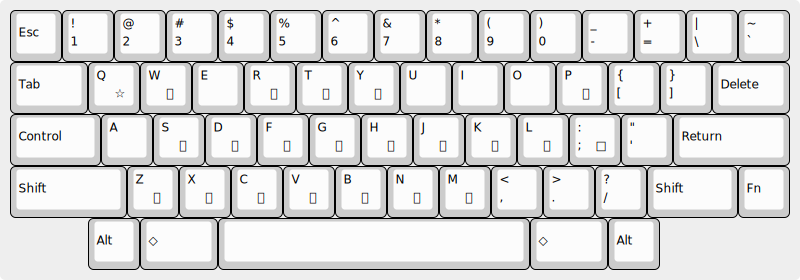

# RGTs - RGT (ローマ字互換単打) 私家版

[RGT (ローマ字互換単打)](https://qiita.com/dulunoj/items/95ebe5e40031183c5eea) は、 dulunoj さんが考案した拡張ローマ字入力方式です。
[AZIK](http://www1.vecceed.ne.jp/~bemu/azik/azikinfo.htm) などと同様に、ローマ字入力の効率化を目的としていますが、 “単独の子音キーにかなを割り当てる” というアイデアにより、通常のローマ字入力に比べて、打鍵数で 20% 以上削減できるとしています。

RGTs は、 RGT に筆者の解釈を加えた “私家版” です。
[kkh.el](https://github.com/yoyuse/kkh) や [Google 日本語入力](https://www.google.co.jp/ime/) の上で実装を行いました。

## RGT の概要

RGT の中心となるアイデアは、出現頻度の高いかなを、できるだけ多く “単打” 、つまり単独の打鍵として割り当てるというものです。
RGT では、次のように単打のかなを定義しています。

- ローマ字から連想しやすいもの
  - `を`(`w`) `る`(`r`) `た`(`t`) `し`(`s`) `で`(`d`) `が`(`g`) `は`(`h`) `か`(`k`) `ま`(`m`)
- 連想的ではないが出現頻度の高いもの
  - `こ`(`p`) `と`(`f`) `の`(`j`) `す`(`l`) `て`(`z`) `っ`(`x`) `く`(`c`) `に`(`v`) `な`(`b`)



- これにより、 `しました`(`smst`) `ですが`(`dlg`) `なにを`(`bvw`) などと入力できます
- 単打 (子音キー) のあとに母音が続くときは、単打は “取り消し” され、通常のローマ字になります。例えば、 `r` は単体では `る` ですが `ra` は `ら` になります
- 逆に、単打を活かして母音を続けたいときは、単打の取り消しをキャンセルする必要があります。例えば、「かいぎ」と入力する場合、単打の `k` と `igi` を何らかの方法で区切らないといけません。 RGT ではこの目的にスペースを割り当てているようですが、詳細はよくわかりません

## 私家版の独自の仕様

私家版として実装するにあたり、仕様の詳細を次のように決めました。

- 単打と母音などの区切りに `;` を使う
  - オリジナルの RGT ではスペースを使うとありますが、 space キーは漢字変換や空白の入力に使いたいので、私家版では代わりに semicolon (`;`) を使います。例えば「かいぎ」は `k;igi` と入力します (または、後述の `q` を使って `kqgi` と入力します)
- 促音 (`っ`) には単打の `x` のみを使う
  - 通常のローマ字入力では、子音の連打で促音を入力しますが、「かけい」(`kkei`) が「っけい」になってしまいます。そこで私家版では、促音は単打の `x` でのみ入力することとします
- 撥音 (`ん`) は単打の `n` を使う
  - 「かんねん」は `knnen` と入力します (`knnnen` では「かんんねん」になってしまいます)
  - `ん`(`n`) の直後に母音などが続く場合は `n;` とします。例えば「けんあく」は `ken;ac` と入力します
- `y` の単打に `き` を割り当てる
  - オリジナルの RGT では、 `y` の単打には割り当てがありませんが、私家版では、他の単打かなに次いで出現頻度の高いと思われる `き` を割り当てます
  - 私家版の実装では、単打の `き`(`y`) と `y` による拗音の入力は両立します。例えば「しきしゃ」は `sysya` で入力できます
- 単打のあとに続く `q` を “ワイルドカード” 的に使う

最後の `q` について説明します。

RGT を使っていると、「かいてい」や「くうこう」など、単打のあとに特定の母音が続く場合 (AZIK でいうところの「子音 + 二重母音」のパターン) が、比較的多く出現することに気づきます。
これを、区切りの `;` を使って `k;iz;i` や `c;up;u` のように入力すると、せっかくの単打による省力化が相殺されてしまいます。

そこで、私家版では “特定の母音” を `q` で表すこととしました。
具体的には、次のように定めます。

- ア段・エ段の単打に続く時は `い`
  - `たい`(`tq`) `がい`(`gq`) `はい`(`hq`) `かい`(`kq`) `てい`(`zq`) `ない`(`bq`) `まい`(`mq`)
- ウ段・オ段の単打に続く時は `う`
  - `こう`(`pq`) `とう`(`fq`) `のう`(`jq`) `すう`(`lq`) `くう`(`cq`)
- 例外
  - `るい`(`rq`) `きょ`(`yq`) `しょ`(`sq`) `であ`(`dq`) `っけ`(`xq`) `にゅ`(`vq`)

例外のうち、 `であ`(`dq`) は「だ・である調」の文体への対応、`っけ`(`xq`) は `xke` が `っけ` にならない (`ヶ` になる) 問題の回避策です。

この定義により、「かいてい」や「くうこう」は `kqzq` や `cqpq` で入力でき、単打の利点を活かせられるようになります。

## 私家版の評価

dulunoj さんは RGT の入力効率について次のように述べています。

> [「文字は読むため、文は伝えるため」](http://semialt.hatenablog.com/entry/2016/12/25/181638)の記事では、２１８文字の例文で色々な方式の比較をしています。  
> ＲＧＴ方式でも同じ例文を入力してみたところ、２９３打数となりました。  
> AZIKと同じくシフトが無いので「動作数」と「総打数」は一致しています。
>
> AZIKの３４０打数、Nicolaの３１２打数よりも低い打数となり、ローマ字入力と比べると２０％以上の削減となり、かなり入力効率の高いことが分かりました。

同じ 218 文字の例文で計測すると、私家版の総打数は 285 打鍵となり、オリジナルの RGT からさらに入力効率の改善が見られました。

他の入力方式との比較も行いました。
使用した文章は、「日本国憲法前文」と「めくらぶどうと虹」、
比較した入力方式は、かな入力・[AZIK](http://www1.vecceed.ne.jp/~bemu/azik/azikinfo.htm)・[花配列](http://togasi.my.coocan.jp/hana_no_kuni/index.html)・[月配列2-263](https://jisx6004.client.jp/tsuki.html) (いずれも USキーボード用にアレンジしたもの、 AZIK は特殊拡張を含む) です。
比較・計測には [laytest](https://yoyuse.github.io/laytest/laytest.html) を用いました。

「日本国憲法前文」(863 文字) での省力性能比較

| 方式     | 打鍵数 | シフト | 総打数 | 打/字 | 省力率 |
|:---------|-------:|-------:|-------:|------:|-------:|
| ローマ字 |   1475 |      0 |   1475 |  1.71 |   0.0% |
| USかな   |    922 |    105 |   1027 |  1.19 |  30.4% |
| AZIK     |   1233 |      0 |   1233 |  1.43 |  16.4% |
| US花     |   1123 |      0 |   1123 |  1.30 |  23.9% |
| US月     |   1097 |      0 |   1097 |  1.27 |  25.6% |
| RGTs     |   1097 |      0 |   1097 |  1.27 |  25.6% |

「めくらぶどうと虹」(2769 文字) での省力性能比較

| 方式     | 打鍵数 | シフト | 総打数 | 打/字 | 省力率 |
|:---------|-------:|-------:|-------:|------:|-------:|
| ローマ字 |   4864 |      0 |   4864 |  1.76 |   0.0% |
| USかな   |   3045 |    335 |   3380 |  1.22 |  30.5% |
| AZIK     |   4356 |      0 |   4356 |  1.57 |  10.4% |
| US花     |   3733 |      0 |   3733 |  1.35 |  23.3% |
| US月     |   3779 |      0 |   3779 |  1.36 |  22.3% |
| RGTs     |   3600 |      0 |   3600 |  1.30 |  26.0% |

RGTs (RGT 私家版) の省力率が、ローマ字系の AZIK を大きく上回り、かな系の花配列や月配列と同等か、それ以上の数値を達成しているのが見て取れると思います。

USかな入力は 47 キーに加えて Shift キーも使用するので別格とするとして、 RGTs は、ローマ字系の方式であること、使用キー数が花配列や月配列と同じ 33 ということを考えると、打鍵数の観点では、この条件での最適解に近い入力方式と言えるかもしれません。

## 私家版を使う

RGT 私家版の実装は、 [Google 日本語入力](https://www.google.co.jp/ime/) と [kkh.el](https://github.com/yoyuse/kkh) の上で行いました。

### Google 日本語入力

ローマ字テーブルでの実装です。

- [kkh.rgts.romantable.txt](kkh.rgts.romantable.txt)

### kkh.el

[yoyuse/kkh](https://github.com/yoyuse/kkh) は Emacs 上で動作する日本語入力です。
もともとは USかな入力 (USキーボード上の JISかな入力) 用に作成したものですが、配列定義ファイルを追加し RGTs にも対応しました。

筆者はこの実装が気に入って使っていますが、操作方法が独特である (`SPC` が変換でなく空白の入力だったり `RET` が確定でなく改行だったりなど) ことや、かな漢字変換にデフォルトで [Google CGI API for Japanese Input](https://www.google.co.jp/ime/cgiapi.html) を使う (変換内容をインターネットを通じて送受信する) ことなどから、一般のユーザーにはあまりおすすめではありません。
[kkh.el の README](../README.md) を熟読の上でなお利用したい場合は、以下の手順で RGTs を使えます。

kkh.el と extra/kkh-rgts.el を `load-path` の通ったところに置いて init.el に次のように書きます。

``` emacs-lisp
(require 'kkh)
(require 'kkh-rgts)
(setq default-input-method "japanese-kkh")
(setq kkh-default-layout-name "rgts")
```

`C-\` (`toggle-input-method`) で、 RGTs による日本語入力モードが ON になり、モードラインの左端に `か(RGTs)` という表示が現れます。
再度 `C-\` とすると、日本語入力モードが OFF になります。

## 所感

筆者が、実際に RGTs を 1 か月ほど使用して感じたことを記します。
Emacs 上の kkh.el を主に用いました。

- ローマ字入力をベースにしつつ、大幅に打鍵数を削減し、花配列や月配列と同等以上の省打鍵化を実現しているのは、大きな魅力
- それでいて、学習コストは月配列などに比べてかなり低い (すでにローマ字入力に慣れている想定ですが) のは特筆すべき点だと感じました
- とはいえ、単打かなをスムーズに打てるようになるには、意識的な練習が必要そうです
  - 慣れていないと、打とうとする文字が単打で入力できるのか、そうでないかの判断に頭を使うので、結局は何も考えずにローマ字で打ってしまったほうが速い気がします
  - 筆者は [eerrr](https://yoyuse.github.io/laytest/eerrr.html) (USかなと RGTs に対応した練習プログラム) などを作成して練習しました
- `;` による区切り (打ち消しキャンセル) が RGTs の最大の難所
  - 母音や`y` の前のほか、 `ch`/`gw`/`kw`/`sh`/`ts`/`wh` のような綴りの中でも区切りを要することがあり、しかも、区切りは打鍵数の増加 (単打による打鍵数削減の相殺) につながる要因です
  - 区切りを許容できるかどうかで RGTs の是非の判断が分かれてくるところだと思います
- ローマ字入力よりキーボードを広く使うものの、使用キー数は花配列や月配列と同等
  - Shift キーも必要とせず USかな入力と比べると運指ははるかに楽に感じます
  - 使用キー数が多い分、ローマ字入力より運指がやや難しくなっている気もしますが、逆に指の負荷が分散されて運指が改善されている気もしました
  - 花配列や月配列との比較は、筆者の経験が浅いためよく分からず、こちらも判断は保留します
- USかな入力と干渉する感覚があります
  - ローマ字入力と USかな入力を併用していたときはそうでもなかったのですが、 RGTs と USかな入力を併用すると、運指に混乱がみられました
  - RGTs が、かな系配列の特徴を併せ持つ証拠と言えるかもしれません

## 参考サイト

- [RGT(ローマ字互換単打)による日本語入力の効率化 #AZIK - Qiita](https://qiita.com/dulunoj/items/95ebe5e40031183c5eea)
  - dulunoj さん自身による RGT の記事
- [MS-IME ローマ字仮名変換表 - 作成支援ツール](http://jgrammar.life.coocan.jp/ja/tools/imekeys.htm#Jacql)
  - 佐藤正彦さんの Jacql Typing (ジャックル打鍵法)
  - RGT は Jacql 打鍵法にヒントを得て作られたそうです
- [AZIK総合解説書](http://www1.vecceed.ne.jp/~bemu/azik/azikinfo.htm)
  - 木村清さんの AZIK
- [キー配列第３開発室](https://layout.kachoufuugetu.net/) / [香月配列](https://layout.kachoufuugetu.net/tsuki/qwerty/index.html)
  - mikado さんの 香月配列
  - RGT と出発点は異なるが、結果的に同様のコンセプトの配列
  > qwerty配列の母音を省略すると月配列が出力されるように設定した配列。
- [Keyboard Layout Benchmark](https://web.archive.org/web/20101117015922/http://www.massangeana.com/mas/charsets/laycomp.htm)
  - massangeana さんによる キーボードによるかな入力効率の比較
